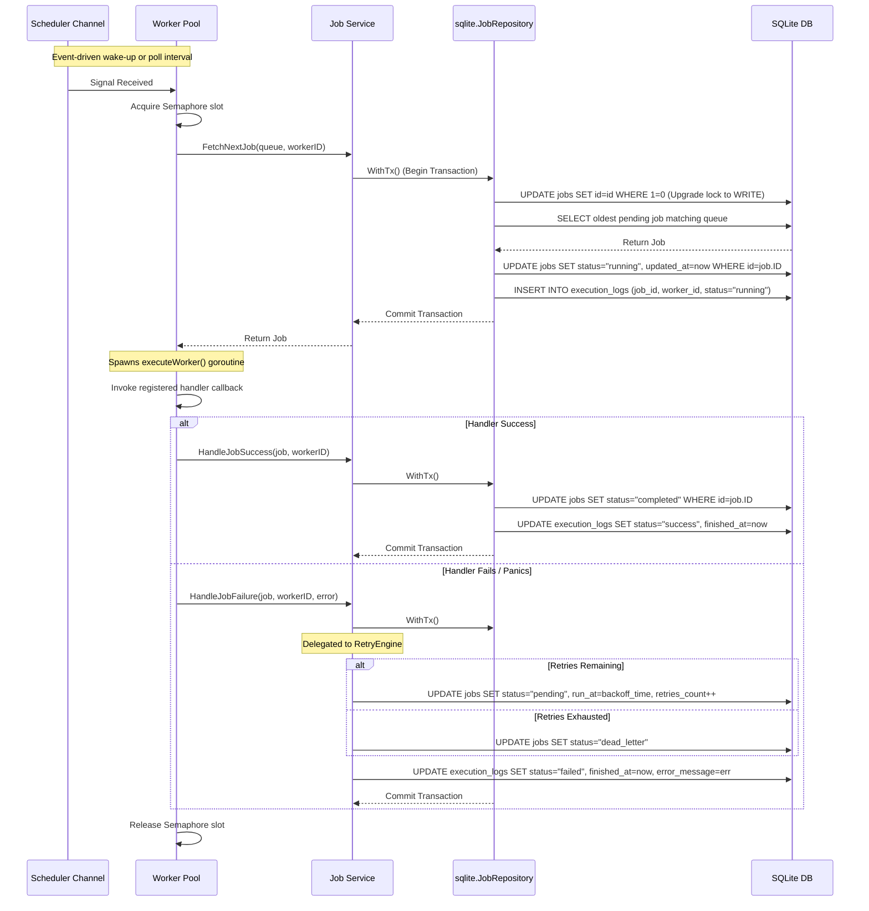

# QueueCTL Architectural Specifications

This document outlines the detailed system design, component interactions, transaction lifecycles, and database locking patterns of QueueCTL.

---

## 🏛️ Clean Architecture & SOLID Principles

QueueCTL is structured using clean architectural layers to keep business rules isolated from database concerns, external daemons, and command-line interfaces.

```
       ┌─────────────────────────────────────────────────────────┐
       │                  Cli Layer (Cobra CLI)                  │
       │  Adapts terminal flags, formats outputs via Tabwriters.  │
       └────────────────────────────┬────────────────────────────┘
                                    │
                                    ▼
       ┌─────────────────────────────────────────────────────────┐
       │                Service Layer (JobService)               │
       │  Coordinates transaction lifecycles & domain entities.  │
       └────────────────────────────┬────────────────────────────┘
                                    │
       ┌────────────────────────────┼────────────────────────────┐
       │                            │                            │
       ▼                            ▼                            ▼
┌──────────────┐             ┌──────────────┐             ┌──────────────┐
│Worker Engine │             │Retry / DLQ   │             │ Repository   │
│Goroutine     │             │Rescheduling  │             │ Contract     │
│Semaphores    │             │Engines       │             │ Interface    │
└──────────────┘             └──────────────┘             └──────┬───────┘
                                                                 │
                                                                 ▼
                                                          ┌──────────────┐
                                                          │SQLite Adapter│
                                                          │Transactions  │
                                                          └──────┬───────┘
                                                                 │
                                                                 ▼
                                                          ┌──────────────┐
                                                          │SQLite DB File│
                                                          └──────────────┘
```

1.  **Domain Entities** (`internal/domain`): Encapsulates core business objects (`Job`, `Worker`, `ExecutionLog`) and state validation rules.
2.  **Repository Contracts** (`internal/repository`): Defines abstractions for data persistence. This ensures that the core domain is completely decoupled from the underlying storage mechanism.
3.  **Service Layer** (`internal/service`): Coordinates application-wide orchestrations, handling transactional scopes and delegating business math to sub-engines.
4.  **CLI Command Layer** (`internal/cli`): Configures command flags, parses inputs, and outputs formatted console streams.

---

## 🔄 Sequence Diagrams

### 1. Job Enqueue Workflow
When a client enqueues a background job:
1.  The CLI/SDK validates the payload (e.g. valid JSON).
2.  The `JobService` instantiates a new `Job` entity.
3.  The repository persists the job using an immediate write transaction.
4.  The `Scheduler` triggers a non-blocking wake notification on the queue channel to instantly wake up any idle worker pool.

```mermaid
sequenceDiagram
    participant App as Client Application
    participant Svc as Job Service
    participant Sched as Scheduler Wakeup
    participant Repo as sqlite.JobRepository
    participant DB as SQLite DB

    App->>Svc: Enqueue(jobType, payload, queue, priority, runAt, maxRetries)
    Svc->>Svc: Validate and create Job structure
    Svc->>Repo: Insert(ctx, job)
    Repo->>DB: BEGIN IMMEDIATE; INSERT INTO jobs ...; COMMIT;
    DB-->>Repo: Success
    Repo-->>Svc: Success
    Svc->>Sched: Notify(queue) (Non-blocking write to channel)
    Svc-->>App: Return Enqueued Job Metadata
```

### 2. Worker Polling & Execution Loop
The worker pool uses a semaphore channel to limit concurrent execution.
1.  The worker pool waits for either a periodic poll ticker or an event notification from the scheduler's wake channel.
2.  It acquires a semaphore slot.
3.  It calls `FetchNextJob()`.
4.  The transaction begins with a lock-upgrading statement (`UPDATE jobs SET id = id WHERE 1=0`) to secure an immediate SQLite write lock.
5.  It selects the highest-priority pending job that is ready to run and transitions its status to `running`.
6.  An `execution_log` entry is created.
7.  The job is executed in a concurrent goroutine.
8.  The handler outcome (success or failure) is updated within a second transaction.



---

## 🔒 Concurrency Controls & SQLite Optimization

SQLite is a single-writer database. Attempting to write concurrently from multiple connections can lead to circular deadlocks or `database is locked` errors. QueueCTL solves this at the database, driver, and application layers:

### 1. Single-Writer Connection Pool
QueueCTL limits the connection pool limits to a single connection for write queries:
*   `db.SetMaxOpenConns(1)`
*   `db.SetMaxIdleConns(1)`
This configuration forces the Go `database/sql` driver to queue concurrent writes in-memory, eliminating connection-level locking conflicts.

### 2. Write-Ahead Logging (WAL) Mode
By enabling WAL mode (`PRAGMA journal_mode=WAL;`), SQLite writes modifications to a separate log file (`.db-wal`) rather than directly modifying the main database file. 
*   **Result**: Readers do not block writers, and writers do not block readers. Workers can query status statistics and list jobs in real-time without delaying active job processing.

### 3. Lock Upgrading inside Transactions
SQLite deferred transactions (`BEGIN DEFERRED`) do not acquire a write lock until the first write operation is executed. If two connections read data in parallel and then attempt to write, both will attempt to upgrade their read locks to write locks, causing a circular deadlock.

QueueCTL solves this inside `WithTx` by immediately upgrading the transaction lock using an empty update:
```sql
UPDATE jobs SET id = id WHERE 1=0
```
This query does not modify any rows, but it instantly upgrades the connection's lock to a SQLite write lock (`IMMEDIATE`). Any other concurrent transactions seeking write locks are queued in-memory, preventing deadlocks.

---

## 🛡️ Robustness & Recovery Systems

### 1. Worker Heartbeats & Version Checks (OCC)
Workers maintain their active status records inside the `workers` table. To protect against race conditions:
*   Every worker updates its `last_heartbeat` timestamp in the database every 5 seconds.
*   Heartbeat updates use **Optimistic Concurrency Control (OCC)**, verifying that the worker record has not changed before completing the write.

### 2. Auto-Reclamation Engine
If a worker process terminates abruptly (e.g. power failure, `SIGKILL`), the active jobs remain marked as `running` in the database, blocking their execution.
QueueCTL implements a background reclaimer inside `ReclaimOrphanedJobs`:
1.  Finds all workers whose `last_heartbeat` has not been updated for over 30 seconds.
2.  Deletes those worker records or marks them as `stopped`.
3.  Queries all jobs assigned to those dead workers that are still in `running` status.
4.  Re-queues those jobs to `pending` (incrementing their retry count) or routes them to the Dead Letter Queue (DLQ) if they have exceeded `max_retries`.

### 3. Graceful Shutdown Hooks
QueueCTL intercepts termination signals (`SIGINT`/`SIGTERM`) to guarantee graceful shutdowns:
*   Upon signal interception, the worker pool immediately stops polling for new jobs.
*   Active worker goroutines are allowed to finish processing their current jobs.
*   Once all active tasks finish and record their outcome (success/failure), the worker pool terminates the heartbeat loop and gracefully unregisters from the database.
*   If active tasks hang or fail to complete within 30 seconds, a fallback thread triggers a forced exit to prevent infinite hangs.
