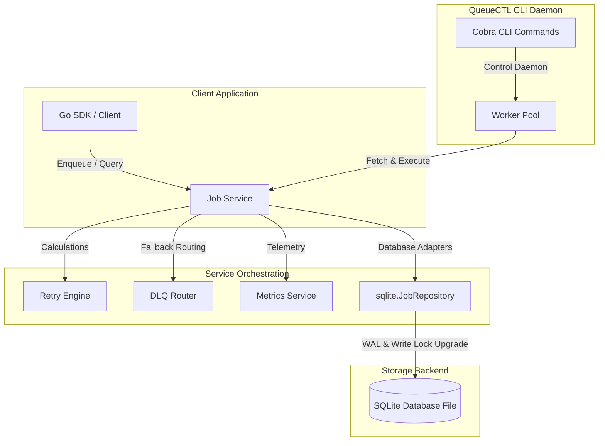

# QueueCTL

[](https://golang.org/)
[](https://opensource.org/licenses/MIT)
[](https://github.com/utkarsh/QueueCTL/actions)
[](https://github.com/utkarsh/QueueCTL)

QueueCTL is a **production-grade, highly concurrent, and ultra-reliable background job queue engine** implemented in Go. It uses **SQLite** as its persistent storage backend, leveraging Write-Ahead Logging (WAL) and transaction serialization to provide strict ACID guarantees. It functions without the operational overhead of external broker dependencies (such as Redis, RabbitMQ, or PostgreSQL).

Designed around Clean Architecture, QueueCTL is built to handle mission-critical background processing workloads with strict safety guarantees, including **Optimistic Concurrency Control (OCC)**, **graceful shutdown capabilities**, **event-driven low-latency scheduling**, and an **automatic crash-recovery engine**.

---

## 🚀 Features

*   **Transactional Integrity**: Job fetching, lock acquisition, execution log creation, and status updates are grouped within single transactional scopes to prevent partial updates or "ghost" running jobs.
*   **High-Performance SQLite Storage**: Utilizes WAL mode, synchronous normalization, and busy timeouts (5000ms) to support parallel read operations alongside active writes.
*   **Semaphore-Throttled Concurrency**: Worker pools use channel-based semaphores to gracefully throttle concurrent goroutines to match configured limits.
*   **Zero-Poll Scheduler Wakeups**: Enqueuing a job sends a non-blocking notification to an event channel, waking idle worker pools instantly rather than relying on high-frequency database polling.
*   **Optimistic Concurrency Control (OCC)**: Worker heartbeats and status updates utilize versioned locking to safely manage concurrent states without race conditions.
*   **Orphaned Job Recovery**: An automated background reclaimer identifies dead worker nodes (missing heartbeats for >30s) and automatically reschedules their stuck running jobs or routes them to the DLQ.
*   **Exponential Backoff Retry Engine**: Retries failed jobs with a customizable exponential backoff base delay, maximum cap, and randomized jitter.
*   **Dead Letter Queue (DLQ)**: Persistently failing jobs are isolated in the DLQ with full stack-trace error messages, where administrators can inspect, delete, or restore them to a different queue.
*   **Dynamic Configurations**: Integrates Viper to read YAML/JSON configurations, supporting dynamic environment variable overrides and live hot-reloading hooks.
*   **Structured Logging & Telemetry**: Employs structured, high-performance logging via Uber Zap and collects comprehensive queue telemetry metrics (success rates, average runtimes, worker utilization).

---

## 🗺️ Architecture Overview



QueueCTL separates concerns across four distinct layers based on Clean Architecture:
1.  **Domain**: Contains core model schemas (`Job`, `Worker`, `ExecutionLog`) and state contracts.
2.  **Repository**: Provides SQL adapters and transactional wrappers for SQLite.
3.  **Service**: Handles business logic orchestration, retry backoffs, and DLQ routing.
4.  **Worker/CLI**: Executes polling loop cycles, heartbeat routines, and CLI inputs.

---

## 📂 Folder Structure

```text
├── .github/                  # CI/CD Workflows & Issue/PR Templates
├── cmd/
│   └── queuectl/             # CLI application entrypoint (main.go)
├── docs/                     # Detailed architectural, CLI, and API docs
│   ├── ARCHITECTURE.md       # Sequence flows, database schema, and design patterns
│   └── commands.md           # CLI Command reference
├── internal/
│   ├── cli/                  # Cobra commands, options, and rendering templates
│   ├── config/               # Viper configuration loading, defaults, and hot-reloads
│   ├── database/             # SQLite connection pools, WAL setups, and DDL migrations
│   ├── dlq/                  # Dead Letter Queue router, retry, and purge orchestrator
│   ├── domain/               # Core business structures (Job, Worker, ExecutionLog)
│   ├── logger/               # Structured logging contract and Uber Zap adapters
│   ├── metrics/              # Telemetry collector and metrics aggregator
│   ├── repository/           # Data access repository interfaces
│   │   └── sqlite/           # Concrete SQLite database adapters and transactions
│   ├── retry/                # Exponential backoff, jitter, and retry engines
│   ├── scheduler/            # Event-driven worker wake-up notifications
│   ├── service/              # Core business workflow manager (JobService)
│   └── utils/                # JSON validators and general helpers
└── tests/                    # End-to-end integration, stress, and crash recovery suites
```

---

## ⚙️ Configuration

QueueCTL reads configurations from a `config.yaml` file located in your working directory. You can override any config property using environment variables prefixed with `QUEUECTL_` (e.g. `QUEUECTL_DATABASE_PATH`).

```yaml
database:
  path: "./queue.db"                    # SQLite database file location

worker:
  concurrency: 5                         # Concurrency limit (number of simultaneous jobs per worker)
  poll_interval: "1s"                    # Fallback poll frequency when no jobs are present
  max_retries: 3                         # Default maximum execution attempts before DLQ routing
  backoff_base_delay: "1s"               # Starting backoff delay for retries
  backoff_max_delay: "30s"               # Upper delay cap for backoff calculations

logger:
  level: "info"                          # Debug, info, warn, error
  format: "console"                      # Console (human-readable) or json (production logging)
```

---

## 📦 Installation

### Prerequisites
*   **Go 1.20** or newer.
*   **A terminal environment** (Linux, macOS, or Windows PowerShell). No C/GCC compiler is required because QueueCTL uses a **pure Go SQLite driver** (`modernc.org/sqlite`).

### Build from Source
Clone the repository and compile the executable binary:
```bash
git clone https://github.com/utkarsh/QueueCTL.git
cd QueueCTL
go build -o queuectl ./cmd/queuectl
```

### Run via Docker
```bash
# Build the Docker image
docker build -t queuectl .

# Run the worker process with persistent DB storage
docker run -d \
  -v $(pwd)/data:/app/data \
  -e QUEUECTL_DATABASE_PATH=/app/data/queue.db \
  --name queuectl-worker \
  queuectl worker start
```

---

## ⚡ Quick Start

Follow these steps to set up and run a local queue process:

1.  **Start the Worker Pool Daemon**:
    ```bash
    ./queuectl worker start --queue default --concurrency 5
    ```
2.  **Enqueue Background Jobs**:
    Open a separate terminal window and run:
    ```bash
    ./queuectl enqueue email '{"to": "user@example.com", "subject": "Welcome!"}' --priority 10
    ```
3.  **Check Queue Status & Metrics**:
    ```bash
    ./queuectl status
    ./queuectl metrics
    ```

---

## 🛠️ CLI Commands & Reference

QueueCTL provides a complete suite of CLI commands to manage the queue lifecycle:

| Command | Description | Example Usage |
| :--- | :--- | :--- |
| `worker start` | Starts a worker pool listening to a queue. | `./queuectl worker start --queue tasks --concurrency 5` |
| `worker stop` | Stops the running worker process. | `./queuectl worker stop` |
| `enqueue` | Submits a new background job. | `./queuectl enqueue email '{"to": "test@test.com"}'` |
| `list` | Lists all jobs filtered by queue or status. | `./queuectl list --status pending` |
| `status` | Renders a table of queue lengths. | `./queuectl status` |
| `metrics` | Aggregates and displays telemetry metrics. | `./queuectl metrics` |
| `dlq list` | Lists all isolated jobs in the DLQ. | `./queuectl dlq list` |
| `dlq replay` | Re-queues a DLQ job back to a queue. | `./queuectl dlq replay --id <job-id>` |
| `dlq purge` | Deletes a job permanently from the DLQ. | `./queuectl dlq purge --id <job-id>` |

### Example Command Output: `metrics`
```text
============================================================
                     QueueCTL Telemetry Metrics             
============================================================
Job States:
  Pending Jobs:       2
  Running Jobs:       0
  Completed Jobs:     124
  Failed Jobs:        3
  Dead Letter Queue:  1
                      
Execution Performance:
  Total Reschedule Retries:   9
  Average Execution Runtime:  1.2s
  Attempt Success Rate:       97.63%
                              
Worker Telemetry:
  Registered Worker Nodes:  1
  Active Workers:           0
  Worker Node Utilization:  0.00%
============================================================
```

---

## 🔄 Core Lifecycles & Mechanics

### 1. Job State Machine
Jobs transition through states transactionally to guarantee safety under concurrent workloads:

```text
                  ┌───────────────┐
                  │   Pending     │◄──────────────────┐
                  └───────┬───────┘                   │
                          │ (Acquire)                 │ (Reschedule Retry)
                          ▼                           │
                  ┌───────────────┐                   │
                  │   Running     ├───────────────────┤
                  └───────┬───────┘                   │
                          │                           │
            ┌─────────────┴─────────────┐             │
            ▼ (Success)                 ▼ (Failure)   │
    ┌───────────────┐           ┌────────────────┐    │
    │   Completed   │           │ Retries Exist? ├────┘
    └───────────────┘           └───────┬────────┘
                                        │ No (Retries Exhausted)
                                        ▼
                                ┌────────────────┐
                                │  Dead Letter   │
                                └────────────────┘
```

### 2. Retry Mechanism & Backoff
When a job execution handler returns an error, the retry engine:
1.  Increments the job's retry count.
2.  Calculates an exponential backoff delay based on:
    $$\text{delay} = \min(\text{base\_delay} \times 2^{\text{retries\_count}}, \text{max\_delay})$$
3.  Adds a randomized jitter component ($\pm 100\text{ms}$) to prevent "thundering herd" conditions on database connections.
4.  Updates the `run_at` timestamp and transitions the job back to `pending`.

### 3. Dead Letter Queue (DLQ)
If a job exceeds its `max_retries` configuration:
*   Its status transitions to `dead_letter`.
*   The raw error message and full execution stack-trace are persisted.
*   Administrators can run `./queuectl dlq replay` to move it back into a queue or `./queuectl dlq purge` to permanently delete it.

### 4. Graceful Shutdown
Upon intercepting termination signals (`SIGINT`/`SIGTERM`), the worker daemon initiates a clean exit:
*   Stops accepting new jobs.
*   Drains and waits for all actively running worker goroutines to complete.
*   Terminates the heartbeat goroutine.
*   Unregisters the worker node from the database.

---

## 📈 Testing & Coverage Summary

QueueCTL features a high-coverage test suite validating concurrency correctness, stress endurance, database contention, and failover behavior.

```bash
# Run all tests
go test -v -race -count=1 ./...
```

*   **Unit Tests**: Validate individual service calculations, retries, and config parses using mocks.
*   **Integration Tests**: Run active transaction checks, optimistic concurrency collisions, and state changes against standard SQLite connection profiles.
*   **Crash Recovery Tests**: Simulate dead worker nodes to verify that running jobs are successfully reclaimed.

| Packages Checked | Test Coverage | Status |
| :--- | :--- | :--- |
| `internal/service` | `86.0%` | Passed |
| `internal/repository/sqlite` | `83.5%` | Passed |
| `internal/metrics` | `87.5%` | Passed |
| `internal/scheduler` | `100.0%` | Passed |
| `internal/worker` | `82.0%` | Passed |

---

## 🛣️ Future Roadmap

1.  **Lightweight Web Console**: A WebSocket-powered web UI showing active workers, queue lengths, and log feeds.
2.  **Distributed SQLite Sharding**: Shard queues horizontally across multiple database files to bypass SQLite's single-writer constraints.
3.  **Cron Scheduling**: Built-in support for enqueuing jobs periodically based on cron strings.
4.  **Network RPC Access**: Expose API entrypoints via gRPC or HTTP endpoints.

---

## 📄 License

QueueCTL is open-source software licensed under the **[MIT License](./LICENSE)**.
