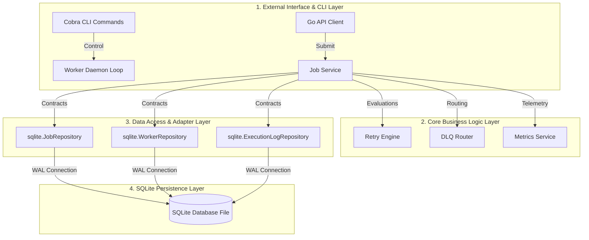
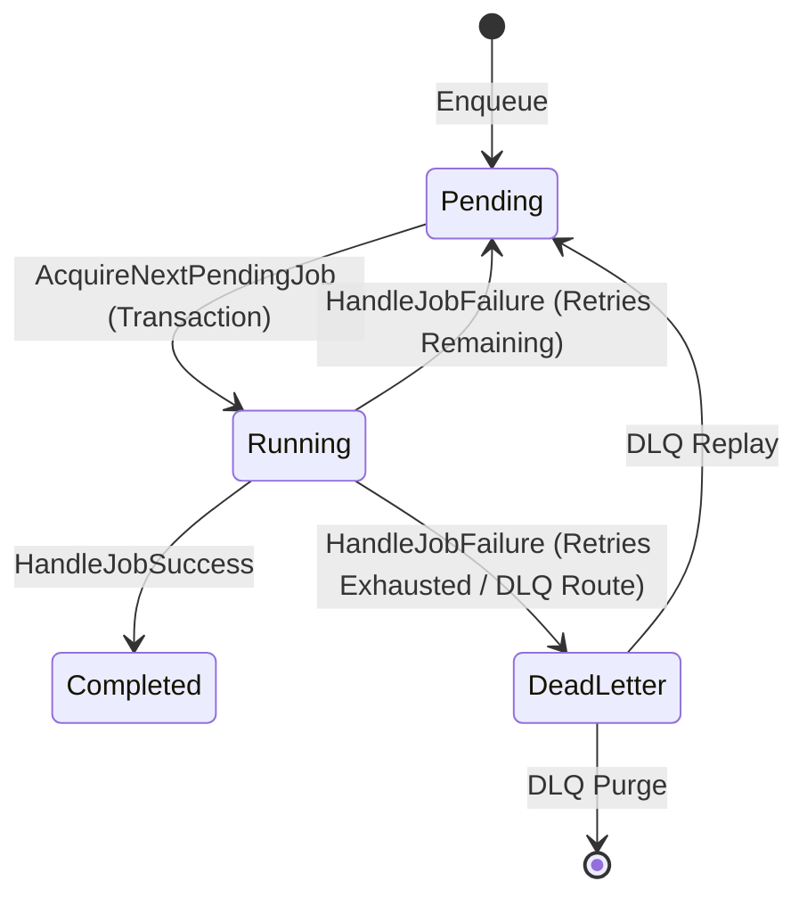
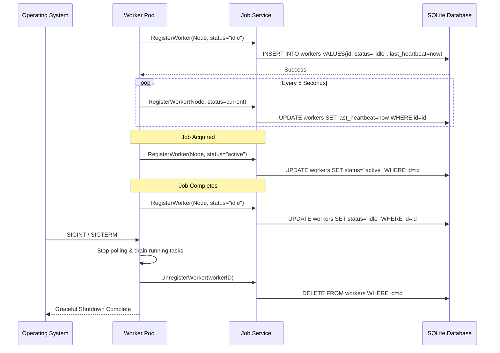
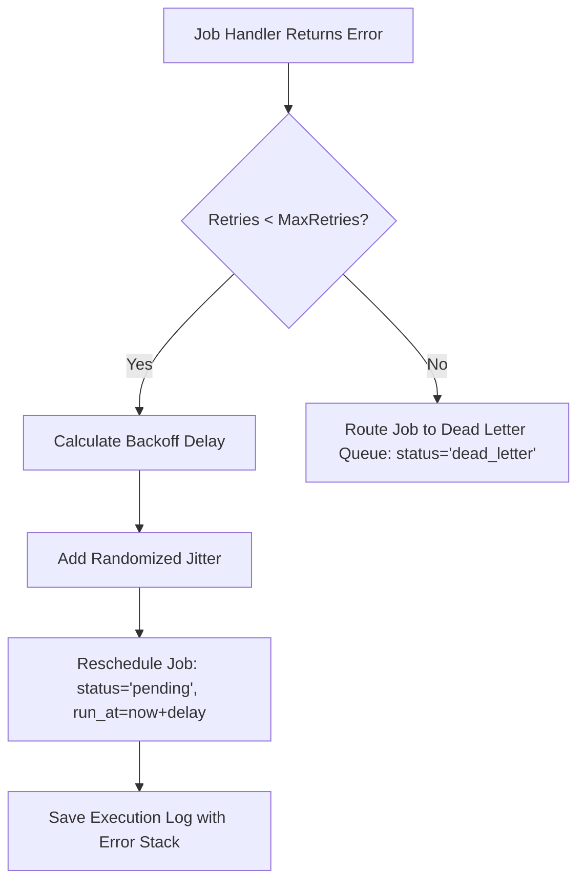
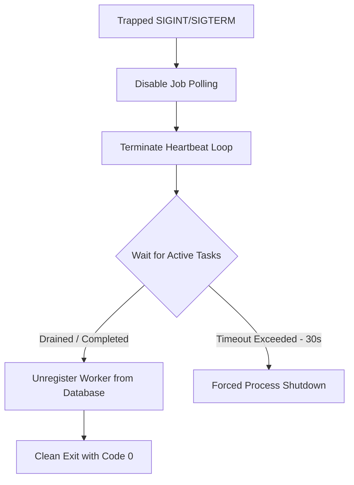

# QueueCTL System Architecture & Design

This document provides a comprehensive deep-dive into the architectural specifications, component lifecycles, SQLite transactional models, concurrency primitives, and failure recovery mechanics of QueueCTL.

---

## 🏛️ High-Level Architectural Design

QueueCTL is designed using **Clean Architecture** patterns combined with DDD (Domain-Driven Design) principles. The system logic is divided into decoupled layers where dependencies point only inwards, ensuring that business rules remain completely isolated from databases, CLI frameworks, and worker orchestration loops.



### Component Responsibilities

| Component | Layer | Description |
| :--- | :--- | :--- |
| **Cobra CLI** (`internal/cli`) | External | Handles terminal input flags, parses config files, formats console tables, and bootstraps daemons. |
| **Worker Engine** (`internal/worker`) | Adapter | Implements the concurrent polling loop, semaphore concurrency throttling, and worker heartbeat loops. |
| **Job Service** (`internal/service`) | Core Service | Orchestrates job transactions, manages state changes, and invokes retry and DLQ calculations. |
| **Retry Engine** (`internal/retry`) | Core Domain | Computes exponential backoff intervals and adds randomized jitter to retry schedules. |
| **DLQ Router** (`internal/dlq`) | Core Domain | Isolates failed jobs, captures full error tracebacks, and handles job replays/purges. |
| **Metrics Service** (`internal/metrics`) | Core Service | Collects queue sizes, average runtime latency, worker utilization, and success rates. |
| **SQLite Adapters** (`internal/repository/sqlite`) | Repository | Houses the raw SQL statements, transaction boundary handlers, and immediate lock upgrading hacks. |

---

## 🔄 Lifecycle Specifications

### 1. Job State Transitions

Jobs progress through a series of transactional states. Any error during execution triggers a retry loop up to a configurable threshold before isolating the job in the Dead Letter Queue.



*   **Pending**: The job is queued in the database. The `run_at` timestamp determines when it is eligible for execution.
*   **Running**: The job is claimed by a specific worker node. The `updated_at` column is refreshed, and an active `execution_logs` entry is populated.
*   **Completed**: The job has finished successfully. Its record remains in the database (or is pruned later) for audit logging.
*   **DeadLetter**: The job has failed `max_retries` times. It is isolated from the polling engine.

### 2. Worker Lifecycle

The worker pool manages the registration, heartbeat, execution, and graceful exit of the executing node.



### 3. Scheduler Lifecycle

The scheduler acts as an event-driven wakeup system that minimizes database polling when the queue is empty:
1.  **Start**: Spawns a background ticker loop configured to check for jobs at `poll_interval`.
2.  **Notify**: When a new job is enqueued, the `JobService` calls `Sched.Notify()`. This performs a non-blocking send to `notifyChan`.
3.  **Wakeup**: The worker pool select loop wakes up immediately upon receiving a signal on `notifyChan`, bypassing the polling ticker and fetching the job with sub-millisecond latency.
4.  **Stop**: Closes the channel and shuts down background ticker loops.

---

## ⚡ Concurrency & SQLite Locking Models

SQLite is traditionally limited by a single-writer constraint. If multiple connections attempt to write concurrently, SQLite will reject them with a `database is locked` error. QueueCTL prevents database contention through three coordinated layers:

### 1. Connection Pool Throttling
We optimize connection limits inside **[internal/database/database.go](file:///c:/Users/utkar/Downloads/QueueCTL/internal/database/database.go)**:
*   `db.SetMaxOpenConns(1)`
*   `db.SetMaxIdleConns(1)`
*   `db.SetConnMaxLifetime(0)`

This configuration forces the Go `database/sql` driver to queue concurrent write transactions **in-memory** within Go’s connection pool, eliminating database-level locking conflicts.

### 2. Write-Ahead Logging (WAL) Mode
We enable WAL mode (`PRAGMA journal_mode=WAL;`) and synchronous normal mode (`PRAGMA synchronous=NORMAL;`). 
*   **Benefit**: This separates database reads from database writes. Readers (polling routines, CLI list, status, metrics queries) do not block writers (enqueuers, worker state transitions), allowing real-time telemetry extraction under high write loads.

### 3. Immediate Lock Upgrades (Circular Deadlock Mitigation)
SQLite deferred transactions (`BEGIN DEFERRED`) do not acquire a write lock until the first write query is executed. If two concurrent transactions read data first and then attempt to write, both will attempt to upgrade their shared read locks to exclusive write locks, causing a circular deadlock.

QueueCTL solves this inside `WithTx` using an immediate, empty lock-upgrading write query:
```sql
UPDATE jobs SET id = id WHERE 1=0
```
This query modifies zero rows but instantly forces SQLite to upgrade the transaction lock to `IMMEDIATE` status. Any other concurrent transactions seeking write locks are cleanly queued in-memory, preventing deadlock failures.

---

## 🛠️ Fault Tolerance & Recovery Flows

### 1. Retry Flow with Exponential Backoff
When a job handler returns an error during execution, the service invokes the retry flow:



The backoff duration is computed as:
$$\text{delay} = \min(\text{base\_delay} \times 2^{\text{retries\_count}}, \text{max\_delay})$$
To prevent "thundering herd" conditions, a randomized jitter of $\pm 100\text{ms}$ is appended to the calculated backoff delay.

### 2. Dead Letter Queue (DLQ) Flow
Jobs that fail all execution attempts are isolated into the DLQ:
*   The job's status is set to `dead_letter`.
*   The final execution error, along with stack traces, is captured and stored inside the `error_message` column of the `jobs` table.
*   **DLQ Replay**: Moving a job back into the queue resets its retry counter to `0`, sets its status to `pending`, and updates the `run_at` time to immediate execution.
*   **DLQ Purge**: Deletes the job permanently from the database.

### 3. Crash Recovery Engine
If a worker process crashes, its running jobs are left orphaned in the `running` state.
1.  **Heartbeat Monitoring**: The reclaimer scans the `workers` table for nodes where:
    $$\text{now} - \text{last\_heartbeat} > 30\text{ seconds}$$
2.  **Worker Stop**: The dead worker's status is changed to `stopped`.
3.  **Job Reclamation**: The reclaimer queries all jobs in `running` status assigned to that worker.
4.  **Re-enqueue/DLQ**: Each orphaned job is either rescheduled to `pending` (incrementing its retry count) or routed to the DLQ if it has exhausted all execution retries.

---

## 🔒 SQLite Database Schema

QueueCTL implements three database schemas configured with optimal index structures for high-speed indexing:

### `jobs` Table
Stores job parameters, schedules, and execution attempt states.
```sql
CREATE TABLE IF NOT EXISTS jobs (
    id TEXT PRIMARY KEY,
    type TEXT NOT NULL,
    payload TEXT NOT NULL,
    queue TEXT NOT NULL,
    status TEXT NOT NULL,
    priority INTEGER NOT NULL DEFAULT 0,
    max_retries INTEGER NOT NULL,
    retries_count INTEGER NOT NULL,
    error_message TEXT NOT NULL DEFAULT '',
    run_at DATETIME NOT NULL,
    created_at DATETIME NOT NULL,
    updated_at DATETIME NOT NULL
);

CREATE INDEX IF NOT EXISTS idx_jobs_status_priority_run_at ON jobs (status, priority DESC, run_at);
CREATE INDEX IF NOT EXISTS idx_jobs_queue_status_priority_run_at ON jobs (queue, status, priority DESC, run_at);
```
*   `idx_jobs_queue_status_priority_run_at`: Crucial for the worker poll query. It optimizes job lookups sorted by priority, queue, and execution schedule.

### `workers` Table
Tracks worker health, registration states, and capacities.
```sql
CREATE TABLE IF NOT EXISTS workers (
    id TEXT PRIMARY KEY,
    hostname TEXT NOT NULL,
    queue TEXT NOT NULL,
    concurrency INTEGER NOT NULL,
    status TEXT NOT NULL,
    started_at DATETIME NOT NULL,
    last_heartbeat DATETIME NOT NULL
);
```

### `execution_logs` Table
Maintains execution records for tracking success/failure telemetry metrics.
```sql
CREATE TABLE IF NOT EXISTS execution_logs (
    id TEXT PRIMARY KEY,
    job_id TEXT NOT NULL,
    worker_id TEXT NOT NULL,
    attempt INTEGER NOT NULL,
    status TEXT NOT NULL,
    started_at DATETIME NOT NULL,
    finished_at DATETIME NOT NULL,
    error_message TEXT NOT NULL DEFAULT ''
);

CREATE INDEX IF NOT EXISTS idx_execution_logs_job_id ON execution_logs (job_id);
```
*   `idx_execution_logs_job_id`: Speeds up job history lookups and telemetry aggregation queries.

---

## 🚪 Graceful Shutdown Sequence

When a termination signal (`SIGINT`/`SIGTERM`) is trapped by the worker process, QueueCTL executes the following shutdown sequence:



This sequence prevents database corruption and ensures that executing tasks are allowed to complete their workflows and record their outcomes.
