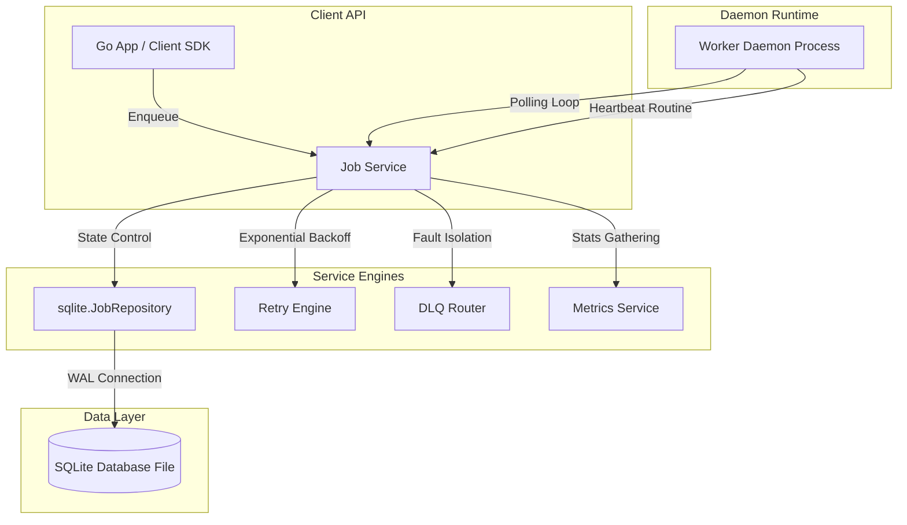

# QueueCTL Portfolio Project Overview

QueueCTL is a highly concurrent, transactional, and ultra-reliable background job queue engine built in Go. It uses SQLite as its primary storage engine, configured for extreme concurrency without external network dependencies (such as Redis, RabbitMQ, or PostgreSQL).

---

## 💡 System Design & Architecture



### Core Architecture Layers (Clean Architecture)
1.  **Domain Entities** (`internal/domain`): Houses the basic structs (`Job`, `Worker`, `ExecutionLog`) and state machines. It is dependency-free.
2.  **Repositories** (`internal/repository`): Defines interfaces for data querying. The `sqlite` package implements these using transactional SQLite drivers.
3.  **Services** (`internal/service`): Contains business logic orchestration, transaction boundaries, retry backoff computations, and Dead Letter Queue routing.
4.  **Worker/CLI** (`internal/worker`, `internal/cli`): Executing loop daemons, task concurrency semaphores, process signal handlers, and terminal CLI interfaces.

---

## ⚡ Concurrency & Lock Serialization (The SQLite Concurrency Solution)

SQLite's primary constraint is its single-writer policy. Under concurrent write loads, other connections are rejected with `database is locked` errors. QueueCTL resolves this at three architectural tiers:

### 1. Connection Pool Throttling
We configure database limits to precisely one writer connection (`MaxOpenConns(1)`). This queues concurrent write operations in-memory in Go's native connection pool rather than letting them hit the database layer concurrently, eliminating lock contentions.

### 2. Write-Ahead Logging (WAL) Mode
By setting `PRAGMA journal_mode=WAL;` and `PRAGMA synchronous=NORMAL;`, readers do not block writers and writers do not block readers. Polling workers, status checks, and telemetry queries can query the database concurrently with active write transactions.

### 3. Immediate Lock Upgrades
SQLite deferred transactions (`BEGIN DEFERRED`) do not acquire a write lock until the first write query is executed. If two parallel routines read first and then attempt to write, a circular deadlock is triggered. QueueCTL solves this by executing an empty write query instantly upon beginning a transaction:
```sql
UPDATE jobs SET id = id WHERE 1=0;
```
This upgrades the connection lock to `IMMEDIATE` status immediately, safely queuing any other write-seeking transactions in-memory.

---

## 🔄 Job Lifecycle & Fault Tolerance

QueueCTL is built with absolute reliability in mind. Jobs transition through state cycles transactionally:
*   **Heartbeats & OCC**: Running worker nodes broadcast heartbeats every 5 seconds. State updates enforce **Optimistic Concurrency Control (OCC)** using atomically incremented `updated_at`/`version` metrics to prevent race updates.
*   **Orphaned Recovery**: An automated background thread identifies dead worker nodes (missing heartbeats for >30s) and automatically re-queues their stuck `running` jobs or routes them to the DLQ.
*   **Exponential Backoff with Jitter**: Execution failures trigger rescheduled delays calculated as $\min(\text{base\_delay} \times 2^{\text{retries\_count}}, \text{max\_delay})$, appended with a randomized jitter of $\pm 100\text{ms}$ to prevent synchronization rushes on database threads.
*   **Dead Letter Queue (DLQ)**: Jobs exceeding retry bounds are isolated to `dead_letter` status with full stack traces saved. Admin endpoints facilitate purging or re-enqueuing.
